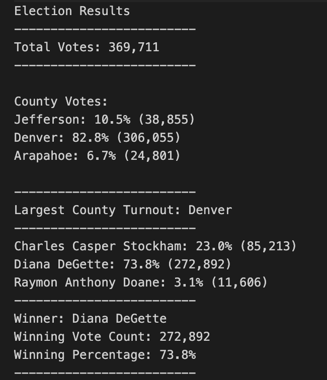

# Election-Analysis

## Overview of Election Audit

 In this project a Colorado Board of Elections employee, Tom, is seeking an assistance in completing the election audit analysis of a recent local congressional election for United States' congressional precinct in Colorado. 

### Purpose

The purpose of this project is to use Python for writing certain algorithms that will assist Tom in fulfilling the request of the election commission and finalizing the election audit analysis that was performed previously with respect to the candidates. The additional data required for completing this audit are with respect to the counties which are as follows: 

- The voter turnout for each county.
- The percentage of votes from each county out of the total count.
- The county with the highest number of votes.

Hence, the final results achieved from this election audit analysis has to be saved to a text file so that it could be easily viewed by the election commission or anyone who is seeking an information about this election.

## Resources

The results are achieved with the use of following software:

- Data Source: election_results.csv
- Software: Python 3.7.6, Visual Studio Code 1.55.2

## Election-Audit Results

For achieving the election-audit results, Visual Studio Code which is also referred to as VS Code was used for writing the required script and running the python file since its very challenging to write long scripts and save them in python interpreter. After running the **PyPoll_Challenge** python file, the following election outcomes were executed:

- The total number of votes that were cast in the Colorado congressional election were **369,711** votes.

- The number of votes and the percentage of total votes for each county that were present in the precinct are displayed in the table below:

| County        | Number of Votes | Percentage of Total Votes |
|     :---:     |     :---:       |           :---:           |
| Jefferson     |     38,855      |           10.5%           |
| Denver        |     306,055     |           82.8%           |
| Arapahoe      |     24,801      |           6.7%            |

- The county with the largest turnout was **Denver** and this was achieved with the use of a decision statement as shown in the script below:

            # 6f: Write an if statement to determine the winning county and get its vote count.
            if county_vote_count > highest_turnout_vote:
                highest_turnout_vote = county_vote_count
                highest_turnout_county = county_name

        # 7: Print the county with the largest turnout to the terminal.
        largest_turnout_results = (f"\n-------------------------\nLargest County Turnout: {highest_turnout_county} \n-------------------------\n")
        print(largest_turnout_results)

- The number of votes and the percentage of total votes for each candidate received  are demonstarted in the table below: 

| Candidate               | Number of Votes | Percentage of Total Votes |
|     :---:               |      :---:      |           :---:           |       
| Charles Casper Stockham |     85,213      |           23.0%           |
| Diana DeGette           |     272,892     |           73.8%           |
| Raymon Anthony Doane    |     11,606      |           3.1%            |

- The winner of this election, with the highest vote count and percentage of total votes was:

        Winner: Diana DeGette
        Winning Vote Count: 272,892
        Winning Percentage: 73.8%

Hence, all of the election-audit results for both the candidates and counties were then written and saved to a text file as shown respectively in the scripts below:

    # Save the results to our text file.
    with open(file_to_save, "w") as txt_file:

        # Print the final vote count (to terminal)
        election_results = (
            f"\nElection Results\n"
            f"-------------------------\n"
            f"Total Votes: {total_votes:,}\n"
            f"-------------------------\n\n"
            f"County Votes:\n")
        print(election_results, end="")

        txt_file.write(election_results)

  
        
    # 6e: Save the county votes to a text file.
     txt_file.write(county_results)

    # 8: Save the county with the largest turnout to a text file.
    txt_file.write(largest_turnout_results)
  
The final text file of election analysis results is depicted in the figure below.
  
  

## Election-Audit Summary

If there are additional data present in the election results data file, the script used for carrying out the election audit analysis can easily be modified to be used for any election in the future. For instance, if analysis of a federal state congressional election is required to be carried out then some of these modifications that could be done to the existing script would be in terms of:

1. Initializing new lists, dictionaries, as well as variables as needed for the new election data such as states if the analysis is for state congressional election.

2. Altering the coding lines that were used for computing the candidate or the county data from the dataset for getting each of the states from each row of our data file.

3. Ensuring the new results that are achieved are written, saved and printed to the text file by adding a new line of script using the **.write( )** function at the end of the new scripts used for computing the new results.

